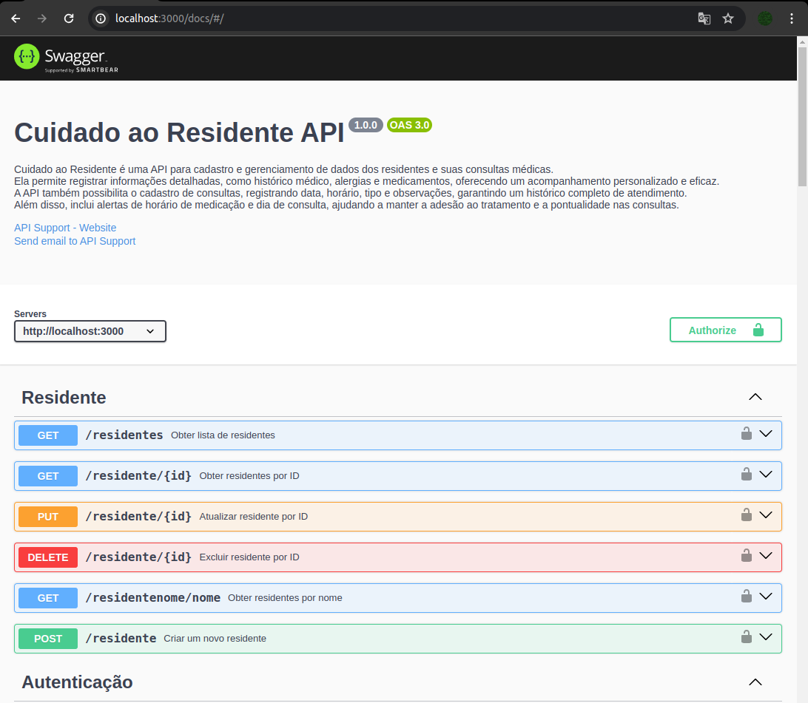
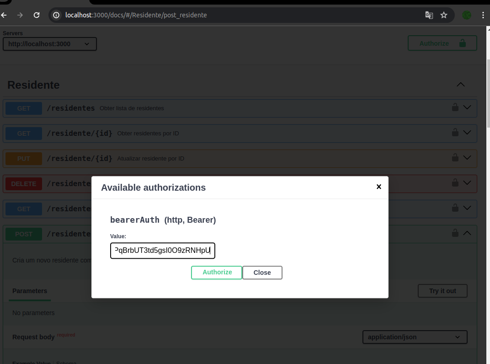
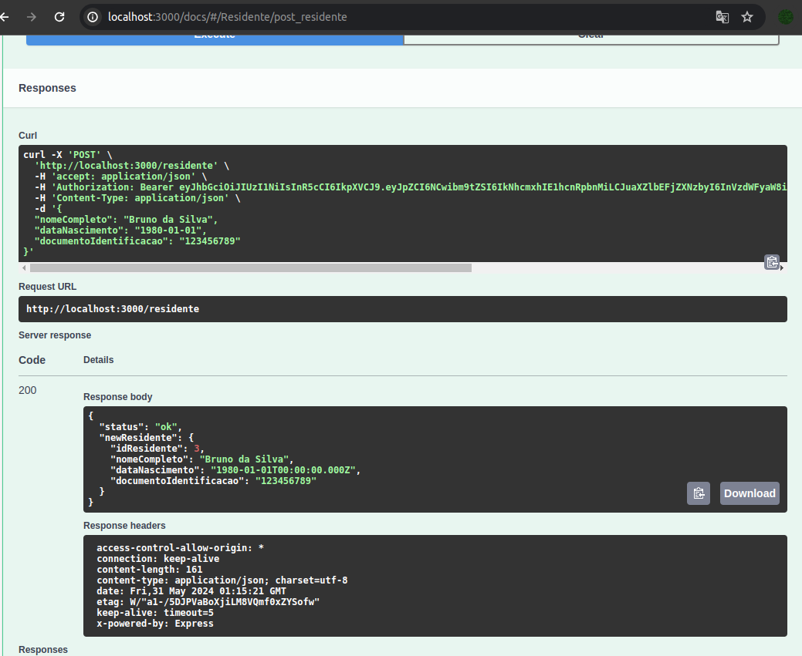
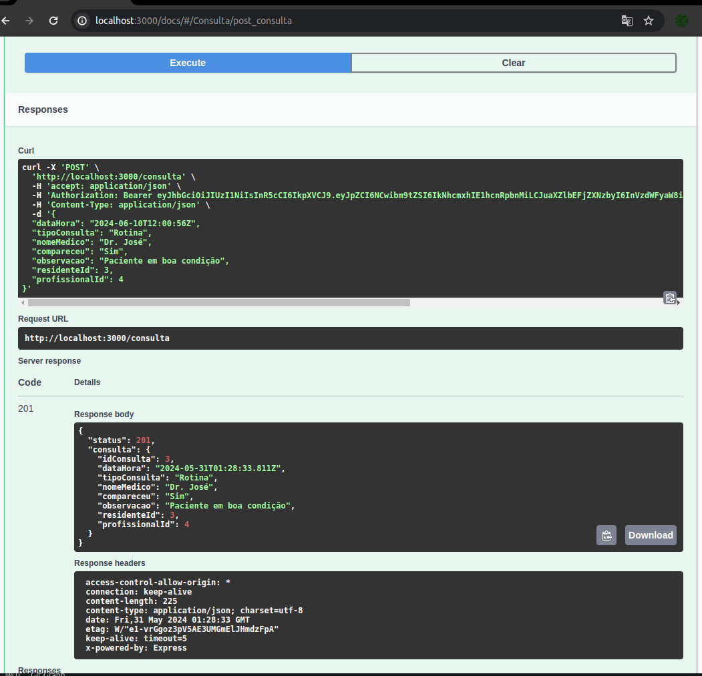
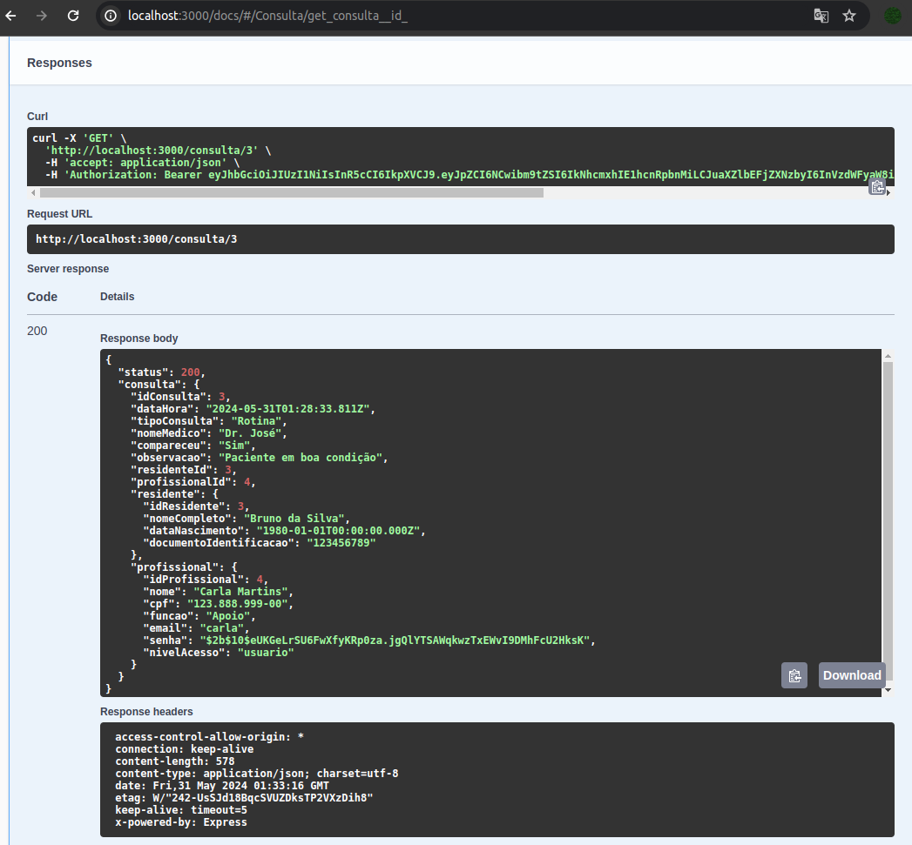
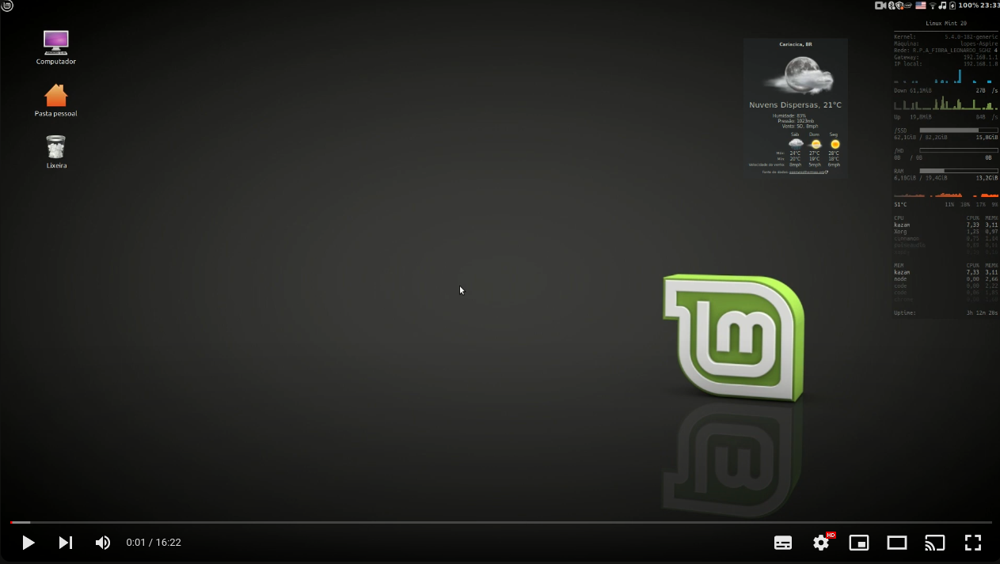
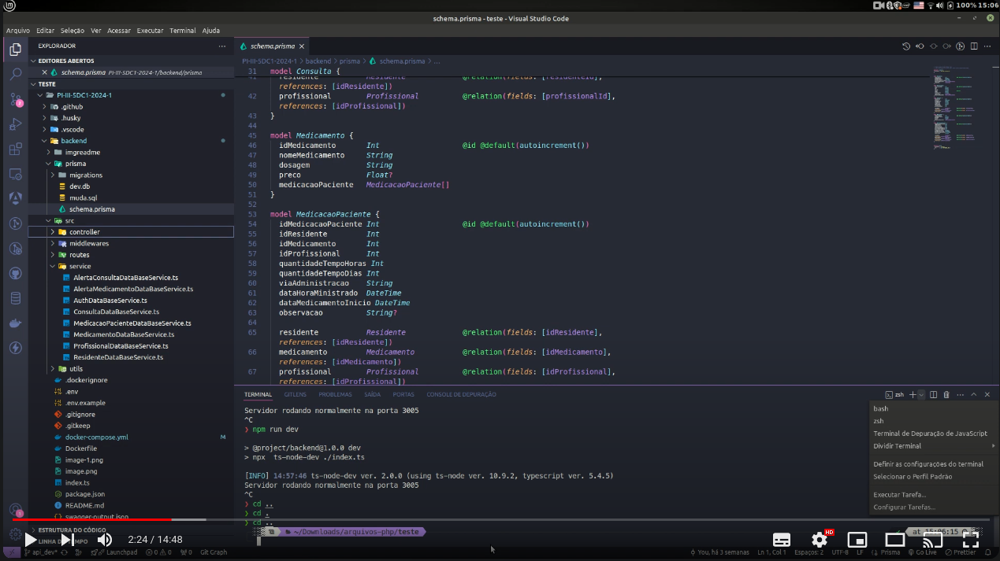

#  Disciplina: PROJETO INTEGRADOR COMPUTAÇÃO III 

## Professor:  [Howard Roatti](https://www.linkedin.com/in/howardroatti/)🔗


## 📋 Backend: Sistema de Alerta de Atividades Importantes

O projeto a ser desenvolvido é um Sistema de Alerta de Atividades Importantes, destinado ao Asilo dos Idosos de Vitória. Este sistema é projetado para gerenciar e monitorar de maneira eficaz diversas atividades importantes dos residentes.

### Funcionalidades do Backend

Este repositório contém o backend do sistema, que é uma API REST responsável pelos seguintes cadastros e funcionalidades:

- **Cadastro de Profissionais:** Registro e gerenciamento dos profissionais que atuam no asilo, incluindo médicos, enfermeiros e outros.
- **Login de Profissionais:** Login e autenticação do profissional esta usando sistema.
- **Cadastro de Medicamentos:** Gerenciamento de informações sobre medicamentos administrados aos residentes.
- **Cadastro de Residentes:** Gerenciamento dos dados dos residentes do asilo, permitindo a atualização e consulta de suas informações.
- **Alertas de Consultas:** Criação e gerenciamento de alertas para consultas médicas, garantindo que os residentes não percam compromissos importantes.
- **Alertas de Medicamentos:** Emissão de alertas sobre os horários de administração de medicamentos, ajudando a assegurar que os residentes recebam seus medicamentos no horário correto.


## 💻 Pré-requisitos

Antes de começar, verifique se você atendeu aos seguintes requisitos:

- Você instalou a versão mais recente do [`Node.js`](https://nodejs.org/en/download)
- Você instalou a versão mais recente do [`Git`](https://git-scm.com/downloads).
- **Para Windows e macOS**: Baixe e instale o Docker Desktop a partir do [site oficial do Docker](https://www.docker.com/products/docker-desktop).
- **Para Linux**: Siga as instruções de instalação específicas para a sua distribuição, disponíveis no [site oficial do Docker](https://docs.docker.com/engine/install/).

--- 
## Tecnologias Utilizadas 🔧

- Prisma ORM
- Visual Studio Code
- Thunder Client
- SQLite
- Microsoft Sql Server
- Node.js
- TypeScript
- Swagger
- JWT
- Docker
- GitHub Actions CI
- Watchtower CD


--- 


**Diretório  e Arquivos:** 📁
   -
```
 backend
        ├── docker-compose.yml
        ├── Dockerfile
        ├── finalbuild
        │   ├── docker-compose.yml
        │   └── README.md
        ├── imgreadme
        │   ├── imageconsulta.png
        │   ├── imageconsultavisu.png
        │   ├── imagedadosidoso.png
        │   ├── imagelogin.png
        │   ├── image.png
        │   ├── imageterminal.png
        │   ├── imagetoken.png
        │   └── Swagger.png
        ├── index.ts
        ├── package.json
        ├── prisma
        │   ├── dev.db
        │   ├── migrations
        │   │   ├── 20240520163936_add_prima_saii_bd
        │   │   │   └── migration.sql
        │   │   └── migration_lock.toml
        │   ├── muda.sql
        │   └── schema.prisma
        ├── README.md
        ├── src
        │   ├── controller
        │   │   ├── AlertaConsultaController.ts
        │   │   ├── AlertaMedicamentoController.ts
        │   │   ├── AuthController.ts
        │   │   ├── ConsultaController.ts
        │   │   ├── MedicacaoPacienteController.ts
        │   │   ├── MedicamentoController.ts
        │   │   ├── ProfissionalController.ts
        │   │   └── ResidenteController.ts
        │   ├── middlewares
        │   │   └── autorizacao.ts
        │   ├── routes
        │   │   ├── AlertaConsultaRoutes.ts
        │   │   ├── AlertaMedicamentoRoutes.ts
        │   │   ├── AuthRoutes.ts
        │   │   ├── ConsultaRoutes.ts
        │   │   ├── MedicacaoPacienteRoutes.ts
        │   │   ├── MedicamentoRoutes.ts
        │   │   ├── ProfissionalRoutes.ts
        │   │   └── ResidenteRoutes.ts
        │   ├── service
        │   │   ├── AlertaConsultaDataBaseService.ts
        │   │   ├── AlertaMedicamentoDataBaseService.ts
        │   │   ├── AuthDataBaseService.ts
        │   │   ├── ConsultaDataBaseService.ts
        │   │   ├── MedicacaoPacienteDataBaseService.ts
        │   │   ├── MedicamentoDataBaseService.ts
        │   │   ├── ProfissionalDataBaseService.ts
        │   │   └── ResidenteDataBaseService.ts
        │   └── utils
        │       └── ComparadorDiaHoras.ts
        ├── swagger-output.json
        ├── swagger.ts
        └── tsconfig.json
```


## Readme Final Build 🔧

- [Readme Projeto Completo com: Docker copose up](finalbuild/README.md)

## 🚀 Rodando o Projeto

Para rodar o projeto, siga estas etapas:

1. Clone o repositório para o seu computador usando o seguinte comando:

    ```bash
    git clone https://github.com/howardroatti/PI-III-5DC1-2024-1.git
    ```

2. Navegue até o diretório do projeto:

    ```bash
    cd PROJETO_INTEGRADOR_III_API
    ```

 # 🐳 Rodando Com Docker:
Se você tiver o Docker e o Docker Compose instalados, execute os seguintes comandos:


```bash
docker-compose up --build -d
 ```

Se você não tiver o Docker instalado, siga para o passo 3 .
  
 

3. Troque de branch para api_dev_sqlite:

   ```bash
      git checkout api_dev_sqlite  
   ```
4. Execute o comando npm install para instalar todas as dependências do projeto:

   ```bash
      npm install package.json
   ```

5. Execute os comandos para gerar o banco de dados do Prisma com SQLite:

   ```bash
      npx prisma generate
      npx prisma migrate      
      npx prisma migrate --schema=./prisma/schema.prisma               
   ```
6. Execute um dos comandos abaixo,  npm run, dentro  da pasta backend, para api_dev para iniciar o servidor de desenvolvimento da API:

   ```bash
         npx ts-node-dev index.ts    
   ```
   ```bash
         npm run dev    
   ```
   ```bash
         npm run swagger    
   ```


Será iniciado um servidor local do frontend na seguinte URL:

```
http://localhost:3005/
```
## 📤 Documentação da Api via Swagger:
```
http://localhost:3005/docs
```



---

## 💼 Apresentação

API do  projeto de gerenciamento de consultas médicas! api aonde o profissionais  podem cadastrar novos profissionais, registrar informações sobre os Residentes sob seus cuidados e agendar consultas médicas.

## 🔧 Configuração e Utilização

### Cadastro de Novo Profissional


Para cadastrar um novo profissional, você pode utilizar a rota `/profissionais` com o método POST. Certifique-se de incluir as informações necessárias no corpo da solicitação, como nome, e-mail e senha.
```
http://localhost:3005/profissional
```


### Login de Profissional

Para efetuar o login de um profissional, utilize a rota `/login` com o método POST. Envie as credenciais de acesso (e-mail e senha) no corpo da solicitação para receber um token de autenticação.
```
http://localhost:3005/login
```


### Cadastro de Novo Residente 

Para cadastrar um novo residente, utilize a rota `/residentes` com o método POST. Forneça as informações requeridas no corpo da solicitação, como nome, data de nascimento e outras informações relevantes. Abrar o modal clicando no cadeado cole o token gerado

```
http://localhost:3005/residente
```
- adcione token gerado no login




- salvando dados do residente




### Agendamento de Consulta

Para agendar uma consulta, utilize a rota `/consultas` com o método POST. Certifique-se de incluir os detalhes da consulta, como data, hora, tipo de consulta e o ID do residente e do profissional associados.
```
http://localhost:3005/consulta
```
- nova consulta



```
http://localhost:3005/consulta/5
```
- visualizar consultas




## 🚫 Rotas Requerendo Autenticação

Todas as rotas, com exceção do cadastro de usuário e login, requerem autenticação via token JWT. <br> Para obter acesso às demais rotas, incluindo aquelas para listar, atualizar e excluir registros, é necessário enviar o token JWT no cabeçalho de autorização da solicitação.

Por exemplo, ao enviar uma solicitação GET para listar todas as consultas, você deve incluir o token JWT no cabeçalho da seguinte forma:

```
Authorization: Bearer SEU_TOKEN_JWT

curl -X 'GET' \
  'http://localhost:3000/consulta/3' \
  -H 'accept: application/json' \
  -H 'Authorization: Bearer SEU_TOKEN_JWT '

```
- Salvando pelo terninal


Certifique-se de obter o token JWT através do processo de login descrito anteriormente.<br>
Com estas instruções, você está pronto para começar a utilizar nossa API de gerenciamento de consultas médicas! 

--- 


## 📤 Enviando as modificações


1. **Clone o Repositório:**
   Abra o terminal e clone o repositório com o comando:
   ```bash
   git clone https://github.com/howardroatti/PI-III-5DC1-2024-1.git
   ```

2. **Entre no Diretório do Repositório:**
   Navegue para o diretório do repositório clonado:
   ```bash
   cd PI-III-5DC1-2024-1
   ```

3. **Faça Checkout para a Branch `api_dev`:**
   Mude para a branch `api_dev`:
   ```bash
   git checkout api_dev
   ```

4. **Crie uma Nova Branch:**
   Crie uma nova branch para suas alterações. Substitua `nome_da_sua_branch` por um nome descritivo para a nova branch:
   ```bash
   git checkout -b nome_da_sua_branch
   ```

5. **Faça Suas Alterações no Código:**
   Faça todas as modificações necessárias nos arquivos do projeto.

6. **Adicione as Alterações:**
   Adicione as alterações ao staging area:
   ```bash
   git add .
   ```

7. **Faça o Commit das Alterações:**
   Commit as alterações com uma mensagem descritiva:
   ```bash
   git commit -m "Descrição das alterações feitas"
   ```

8. **Atualize a Branch com as Últimas Alterações da `main`:**
   Primeiro, mude para a branch `main` e puxe as últimas alterações:
   ```bash
   git checkout main
   git pull origin main
   ```

   Em seguida, volte para a sua branch e mescle as alterações da `main`:
   ```bash
   git checkout nome_da_sua_branch
   git merge main
   ```

9. **Resolva Conflitos de Merge (se houver):**
   Se houver conflitos, resolva-os nos arquivos indicados. Após resolver, adicione os arquivos corrigidos:
   ```bash
   git add .
   git commit -m "Resolução de conflitos"
   ```

10. **Envie a Branch para o Repositório Remoto:**
    Envie sua branch criada para o repositório remoto:
    ```bash
    git push origin nome_da_sua_branch
    ```

11. **Crie um Pull Request:**
    Vá para o repositório no GitHub, clique no botão "Compare & pull request" que deve aparecer após o push. Caso contrário, vá para a aba "Pull requests" e clique em "New pull request".

12. **Preencha os Detalhes do Pull Request:**
    Preencha os detalhes do pull request, como título e descrição, e clique em "Create pull request".

13. **Notifique a Equipe:**
    Informe sua equipe ou a pessoa responsável para revisar e aprovar seu pull request.

##  Vídeo Explicação e uso da API Residentes
[](https://www.youtube.com/watch?v=JwbPxzj2liA)

##  Vídeo  Backend: Explicação de Como Clonar e Rodar o Projeto
[](https://www.youtube.com/watch?v=YoGSLDR713g)
